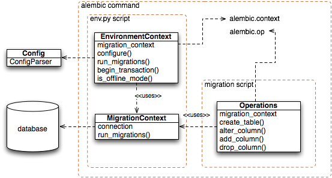

===========
API Details
===========

This section describes some key functions used within the migration process, particularly those referenced within
a migration environment's ``env.py`` file.

Overview
========

The three main objects in use are the :class:`.EnvironmentContext`, :class:`.MigrationContext`,
and :class:`.Operations` classes, pictured below.

An Alembic command begins by instantiating an :class:`.EnvironmentContext` object, then
making it available via the ``alembic.context`` proxy module.  The ``env.py``
script, representing a user-configurable migration environment, is then 
invoked.   The ``env.py`` script is then responsible for calling upon the
:meth:`.EnvironmentContext.configure`, whose job it is to create 
a :class:`.MigrationContext` object. 

Before this method is called, there's not
yet any database connection or dialect-specific state set up.  While 
many methods on :class:`.EnvironmentContext` are usable at this stage,
those which require database access, or at least access to the kind 
of database dialect in use, are not.   Once the 
:meth:`.EnvironmentContext.configure` method is called, the :class:`.EnvironmentContext`
is said to be *configured* with database connectivity, available via
a new :class:`.MigrationContext` object.   The :class:`.MigrationContext`
is associated with the :class:`.EnvironmentContext` object
via the :meth:`.EnvironmentContext.get_context` method.

Finally, ``env.py`` calls upon the :meth:`.EnvironmentContext.run_migrations`
method.   Within this method, a new :class:`.Operations` object, which
provides an API for individual database migration operations, is established
within the ``alembic.op`` proxy module.   The :class:`.Operations` object
uses the :class:`.MigrationContext` object ultimately as a source of 
database connectivity, though in such a way that it does not care if the
:class:`.MigrationContext` is talking to a real database or just writing
out SQL to a file.

env.py Directives
=================

This section covers the objects that are generally used within an 
``env.py`` environmental configuration script.   Alembic normally generates
this script for you; it is however made available locally within the migrations
environment so that it can be customized.

In particular, the key method used within ``env.py`` is :meth:`.EnvironmentContext.configure`,
which establishes all the details about how the database will be accessed.

.. autofunction:: sqlalchemy.engine.engine_from_config

.. automodule:: alembic.environment
    :members:

.. automodule:: alembic.migration
    :members:

Commands
=========

Alembic commands are all represented by functions in the :mod:`alembic.command`
package.  They all accept the same style of usage, being sent
the :class:`~.alembic.config.Config` object as the first argument.

Commands can be run programmatically, by first constructing a :class:`.Config` 
object, as in::

    from alembic.config import Config
    from alembic import command
    alembic_cfg = Config("/path/to/yourapp/alembic.ini")
    command.upgrade(alembic_cfg, "head")

.. currentmodule:: alembic.command

.. automodule:: alembic.command
    :members:
    :undoc-members:

Configuration
==============

.. currentmodule:: alembic.config

.. automodule:: alembic.config
    :members:
    :undoc-members:

Internals
=========

.. automodule:: alembic.script
    :members:
    :undoc-members:

DDL Internals
-------------

.. automodule:: alembic.ddl
    :members:
    :undoc-members:

.. automodule:: alembic.ddl.base
    :members:
    :undoc-members:

.. automodule:: alembic.ddl.impl
    :members:
    :undoc-members:

MySQL
^^^^^

.. automodule:: alembic.ddl.mysql
    :members:
    :undoc-members:
    :show-inheritance:

MS-SQL
^^^^^^

.. automodule:: alembic.ddl.mssql
    :members:
    :undoc-members:
    :show-inheritance:

Postgresql
^^^^^^^^^^

.. automodule:: alembic.ddl.postgresql
    :members:
    :undoc-members:
    :show-inheritance:

SQLite
^^^^^^

.. automodule:: alembic.ddl.sqlite
    :members:
    :undoc-members:
    :show-inheritance:
