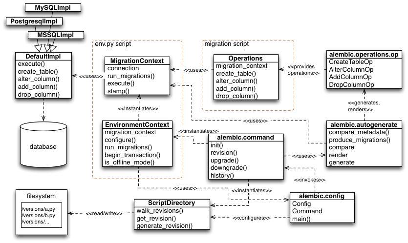

========
Overview
========

.. note:: this section is a technical overview of the
   **internal API of Alembic**.
   This section is only useful for developers who wish to extend the
   capabilities of Alembic; for regular users, reading this section
   is **not necessary**.

A visualization of the primary features of Alembic's internals is presented
in the following figure.   The module and class boxes do not list out
all the operations provided by each unit; only a small set of representative
elements intended to convey the primary purpose of each system.

The script runner for Alembic is present in the :ref:`alembic.config.toplevel` module.
This module produces a :class:`.Config` object and passes it to the
appropriate function in :ref:`alembic.command.toplevel`.   Functions within
:ref:`alembic.command.toplevel` will typically instantiate an
:class:`.ScriptDirectory` instance, which represents the collection of
version files, and an :class:`.EnvironmentContext`, which is a configurational
facade passed to the environment's ``env.py`` script.

The :class:`.EnvironmentContext` object is the primary object used within
the ``env.py`` script, whose main purpose is that of a facade for creating and using
a :class:`.MigrationContext` object, which is the actual migration engine
that refers to a database implementation.   The primary method called
on this object within an ``env.py`` script is the
:meth:`.EnvironmentContext.configure` method, which sets up the
:class:`.MigrationContext` with database connectivity and behavioral
configuration.  It also supplies methods for transaction demarcation and
migration running, but these methods ultimately call upon the
:class:`.MigrationContext` that's been configured.

:class:`.MigrationContext` is the gateway to the database
for other parts of the application, and produces a :class:`.DefaultImpl`
object which does the actual database communication, and knows how to
create the specific SQL text of the various DDL directives such as
ALTER TABLE; :class:`.DefaultImpl` has subclasses that are per-database-backend.
In "offline" mode (e.g. ``--sql``), the :class:`.MigrationContext` will
produce SQL to a file output stream instead of a database.

During an upgrade or downgrade operation, a specific series of migration
scripts are invoked starting with the :class:`.MigrationContext` in conjunction
with the :class:`.ScriptDirectory`; the actual scripts themselves make use
of the :class:`.Operations` object, which provide the end-user interface to
specific database operations.   The :class:`.Operations` object is generated
based on a series of "operation directive" objects that are user-extensible,
and start out in the :ref:`alembic.operations.ops.toplevel` module.

Another prominent feature of Alembic is the "autogenerate" feature, which
produces new migration scripts that contain Python code.  The autogenerate
feature starts in :ref:`alembic.autogenerate.toplevel`, and is used exclusively
by the :func:`.alembic.command.revision` command when the ``--autogenerate``
flag is passed.  Autogenerate refers to the :class:`.MigrationContext`
and :class:`.DefaultImpl` in order to access database connectivity and
access per-backend rules for autogenerate comparisons.  It also makes use
of :ref:`alembic.operations.ops.toplevel` in order to represent the operations that
it will render into scripts.

